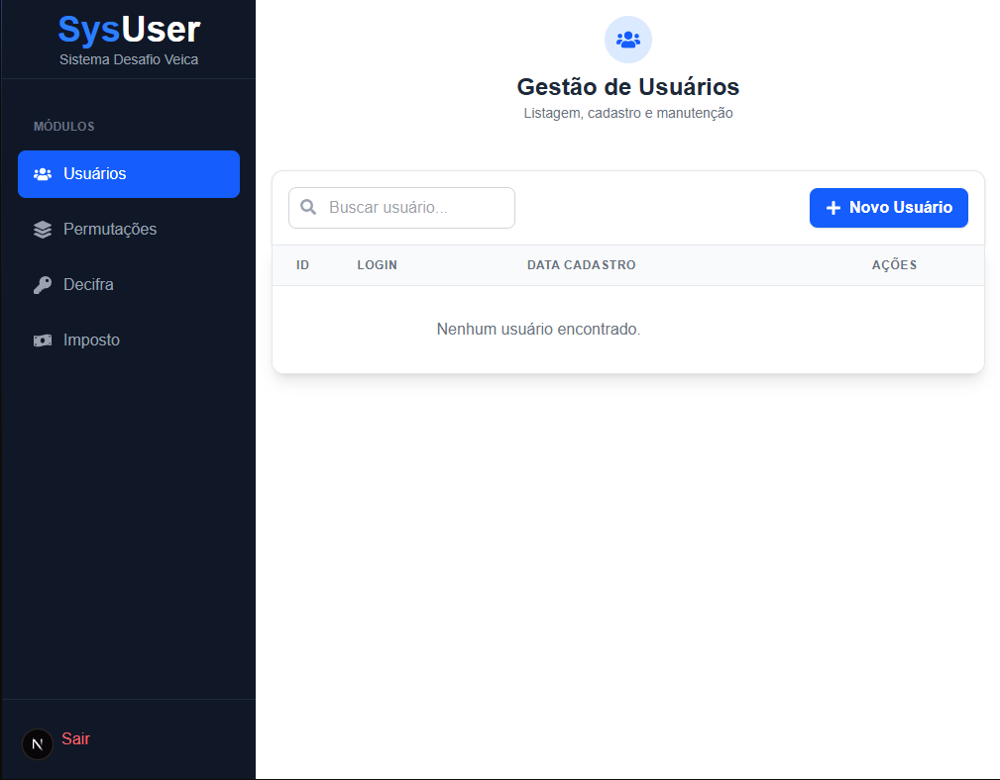
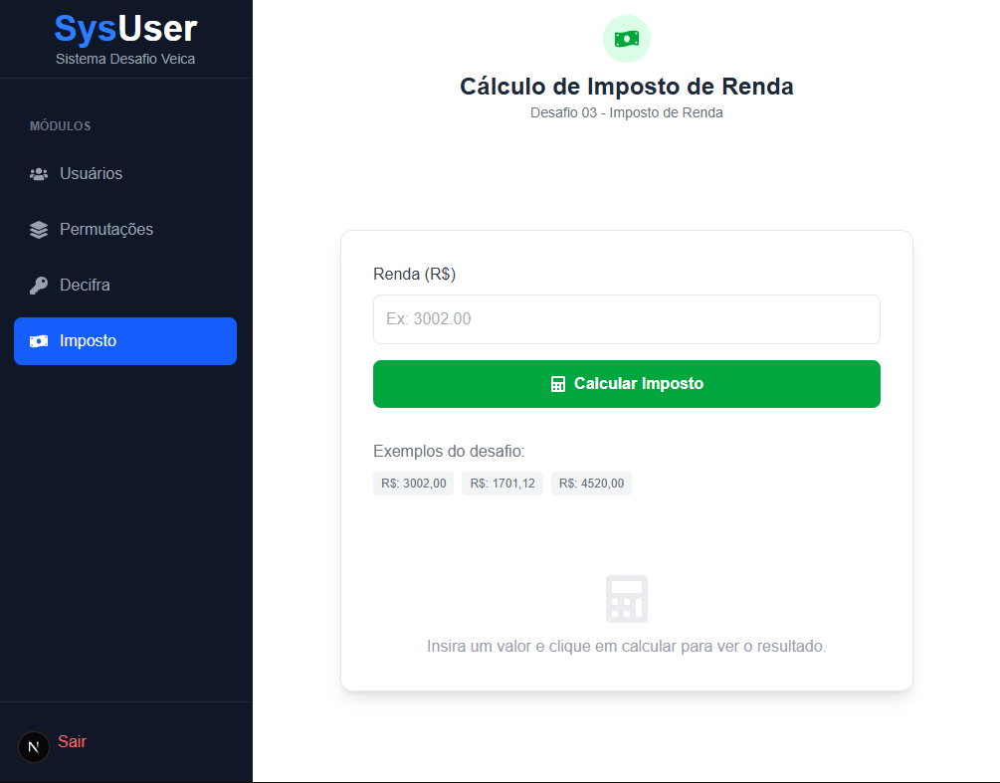

# SysUser - Sistema Desafio Veica

Este é um sistema web desenvolvido como parte de um teste técnico. O objetivo é demonstrar competências em desenvolvimento web, gerenciamento de estado, validação de formulários e resolução de algoritmos lógicos.

O sistema conta com um **CRUD de usuários** e uma seção dedicada à **resolução de desafios lógicos** (Permutações, Decifra e Cálculo de Imposto).


---

## Telas do Projeto

| Login | Gestão de Usuários |
|:---:|:---:|
|  |  |

| Permutações | Decifra | Imposto |
|:---:|:---:|:---:|
|  |  |  |

---

## Funcionalidades

### Autenticação e Segurança
- **Login Seguro:** Validação de credenciais via API simulada.
- **Proteção de Rotas:** Redirecionamento automático caso o usuário não esteja logado (Context API).
- **Persistência:** Manutenção da sessão do usuário via `LocalStorage`.

### Gestão de Usuários (CRUD)
- Listagem de usuários com busca em tempo real.
- Cadastro de novos usuários via Modal.
- Edição de informações existentes.
- Exclusão de registros com confirmação de segurança.

### Desafios de Lógica
- **Permutações:** Algoritmo para gerar combinações de numéros e letras.
- **Decifra:** Ferramenta para descriptografar/traduzir mensagens baseadas em regras específicas.
- **Imposto de Renda:** Calculadora para faixas de imposto baseada no salário informado.

---

## Tecnologias Utilizadas

O projeto foi desenvolvido utilizando as seguintes tecnologias e bibliotecas:

- **[Next.js](https://nextjs.org/)** - Framework React com App Router.
- **[Tailwind CSS](https://tailwindcss.com/)** - Framework de estilização CSS.
- **[React Hook Form](https://react-hook-form.com/)** - Gerenciamento de formulários.
- **[Zod](https://zod.dev/)** - Validação de valores e preenchimento de formularios.
- **[Axios](https://axios-http.com/)** - Cliente HTTP para requisições.
- **[React Icons](https://react-icons.github.io/react-icons/)** - Pacote de ícones.
- **Context API** - Gerenciamento de estado global para autenticação.

---

## Como rodar o projeto

Siga os passos abaixo para executar o projeto em sua máquina local:

### Pré-requisitos
- Ter o **Node.js** instalado (versão 18 ou superior).
- Gerenciador de pacotes **NPM** ou **Yarn**.

### Passo a passo

1. **Clone o repositório**
   ```bash
   git clone [https://github.com/SEU-USUARIO/NOME-DO-REPO.git](https://github.com/SEU-USUARIO/NOME-DO-REPO.git)

2. **Instale as dependencias**
   ```bash
   npm i

2. **Execute o projeto**
   ```bash
   npm run dev